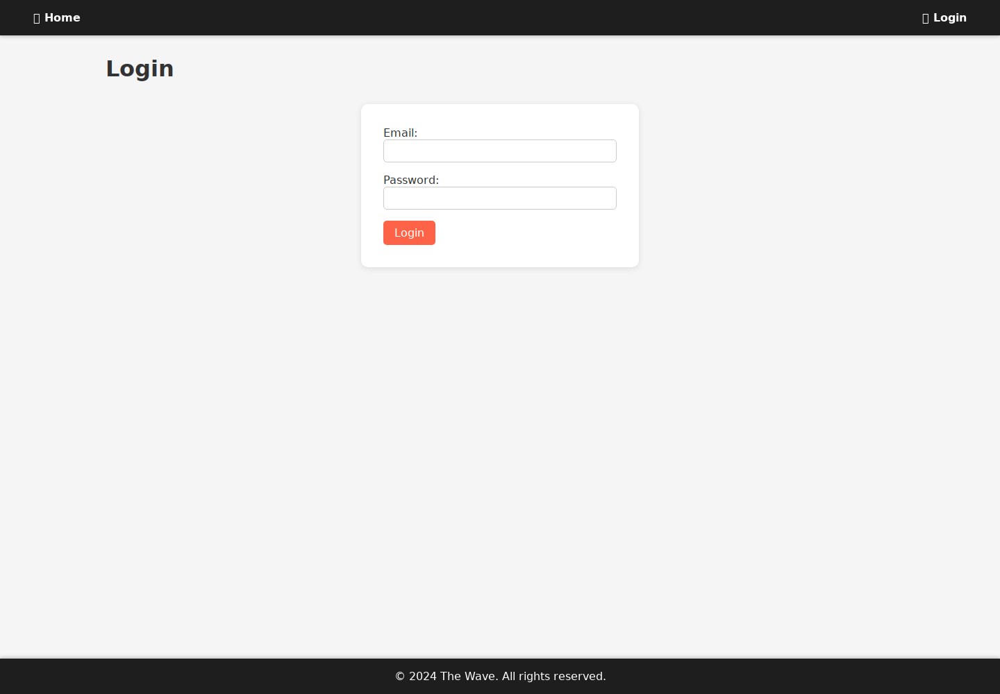

#  The Wave — Plateforme musicale open-source

**The Wave** est une plateforme musicale développée avec Python, Flask et PostgreSQL. Elle permet aux utilisateurs de découvrir, écouter et gérer de la musique via une interface web dynamique.

---


## Aperçu



Page de connexion réellement servie par Flask. Les vues du catalogue, la connexion utilisateur et les fonctions musicales nécessitent PostgreSQL et ne sont pas démontrées par cette capture.

##  Fonctionnalités

-  Connexion / inscription utilisateur
-  Visualisation de musique, playlists, artistes...
-  Backend en Flask avec SQLAlchemy
-  Base de données PostgreSQL (fichier `.sql` fourni)
-  Authentification avec Flask-Login
-  Interface web HTML/CSS dynamique

---

##  Structure du projet
```
The-Wave-Music/
├── app/ # Code principal de l'application (routes, models, etc.)
├── instance/ # Configs spécifiques à l'environnement (facultatif)
├── requirements.txt # Dépendances Python
├── thewave-*.sql # Dump PostgreSQL complet
└── README.md # Ce fichier
```

---

##  Prérequis

- Python 3.10+
- PostgreSQL installé et accessible en local
- pip, venv

---

##  Installation & Lancement

1. Cloner ce dépôt :

```bash
git clone https://github.com/Vincent-P-essy/The-Wave-Music.git
cd The-Wave-Music
``` 

Créer un environnement virtuel et installer les dépendances épinglées :

```bash
python3 -m venv venv
source venv/bin/activate
pip install -r requirements.txt
```

Le schéma et les données PostgreSQL fournis se trouvent dans `sql/dump.sql` ; `sql/schema.sql` et `sql/queries.sql` sont actuellement vides. Ce dump PostgreSQL 16 recrée la base `thewave` et utilise la locale `en_US.utf8` : prévoir une instance locale de démonstration adaptée. Le code utilise actuellement une connexion locale à la base `thewave` avec l’utilisateur PostgreSQL `postgres`. La configuration est définie dans `app/main.py` et `app/db.py` ; une variable `DATABASE_URL` seule ne la remplace pas.

Lancer le serveur depuis la racine du dépôt :

```bash
python3 -m flask --app app.main:create_app run --host 127.0.0.1 --port 8080
```

Ouvrir <http://127.0.0.1:8080/login> pour la page de connexion. Les autres vues nécessitent une base PostgreSQL préparée ; elles ne sont pas couvertes par l’aperçu ci-dessus.

Auteur

Développé par Vincent Plessy — github.com/Vincent-P-essy
