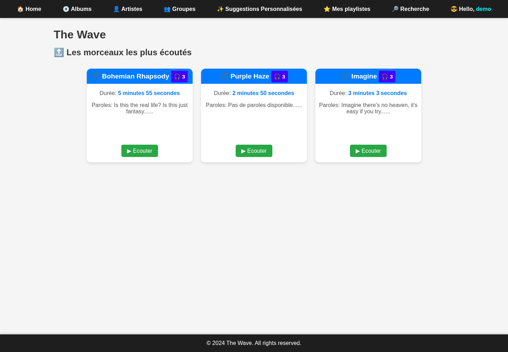
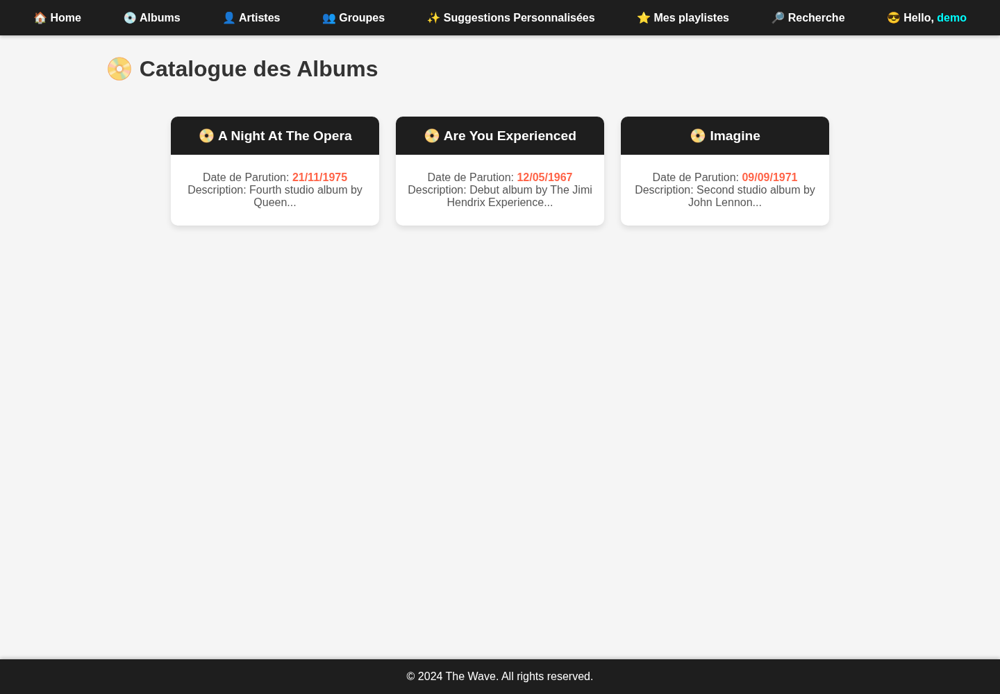
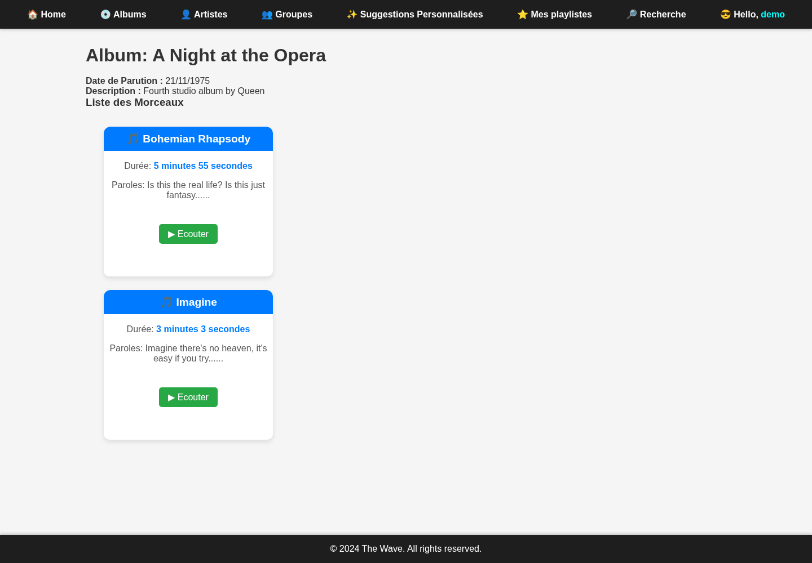

# The Wave — Catalogue musical avec Flask et PostgreSQL

The Wave est un projet de plateforme musicale développé par Vincent Plessy. Il explore un modèle relationnel de morceaux, albums, artistes, groupes, playlists et utilisateurs, avec une interface Flask et des requêtes PostgreSQL.

## Aperçu







Ces captures proviennent de l'application exécutée avec PostgreSQL 16 et `sql/dump.sql`. Le compte `demo` a été créé localement pour la connexion ; les morceaux, albums, artistes et relations affichés viennent du dump fourni. La [capture de connexion](docs/screenshots/login-page.png) est également conservée.

## Fonctionnalités présentes

- Connexion et déconnexion avec Flask-Login et mots de passe bcrypt stockés en base.
- Catalogues et fiches des albums, artistes, groupes et morceaux.
- Recherche par titre de morceau, artiste, album ou playlist.
- Consultation des playlists, avec contrôle d'accès aux playlists privées.
- Enregistrement d'écoutes par utilisateur et morceau, classement et suggestions à partir de cet historique.

Le bouton **Écouter** enregistre une écoute en base : aucun flux audio ni fichier musical n'est fourni. L'inscription et l'édition des playlists ne disposent pas de routes web dans cette version. Les données du catalogue sont importées depuis SQL.

## Stack et organisation

Python 3.10+, Flask, Flask-Login, Flask-SQLAlchemy, Psycopg 2, Passlib/bcrypt, PostgreSQL et templates Jinja HTML/CSS.

```text
app/
├── main.py             # Factory Flask, configuration et chargement de session
├── db.py               # Connexions PostgreSQL fermées après chaque utilisation
├── models.py           # Modèles du schéma dataset
├── routes.py           # Requêtes et vues web
├── templates/          # Pages Jinja
└── static/styles.css
sql/dump.sql            # Schéma, vues, relations et données de démonstration
scripts/create_demo_user.py
requirements.txt        # Dépendances Python épinglées
tests/test_app.py       # Régressions et intégration PostgreSQL
```

`sql/schema.sql` et `sql/queries.sql` sont vides ; le fichier utilisable est `sql/dump.sql`.

## Installation

```bash
git clone https://github.com/Vincent-P-essy/The-Wave-Music.git
cd The-Wave-Music
python3 -m venv venv
source venv/bin/activate
pip install -r requirements.txt
```

### Base de démonstration isolée

Le dump a été produit avec PostgreSQL 16. Il **supprime puis recrée la base `thewave`** et demande la locale `en_US.utf8`. L'import ci-dessous vise exclusivement un conteneur de démonstration dédié, sur le port local 55432, pour éviter de toucher une base existante.

Prérequis de cette procédure : Docker, avec la permission de lancer des conteneurs. Le conteneur utilise une base éphémère et une authentification sans mot de passe sur le port de boucle locale ; cette configuration est réservée à la démonstration locale.

```bash
docker run -d --name thewave-demo-db \
  --publish 127.0.0.1:55432:5432 \
  --env POSTGRES_HOST_AUTH_METHOD=trust \
  --env POSTGRES_INITDB_ARGS='--locale=en_US.utf8' \
  --tmpfs /var/lib/postgresql/data:rw \
  postgres:16

# Attendre que pg_isready annonce « accepting connections » avant l'import.
docker exec thewave-demo-db pg_isready -U postgres
docker exec -i thewave-demo-db psql -U postgres -d postgres \
  -v ON_ERROR_STOP=1 < sql/dump.sql

export DATABASE_URL='postgresql://postgres@127.0.0.1:55432/thewave'
export SECRET_KEY="$(python3 -c 'import secrets; print(secrets.token_hex(32))')"
python -m scripts.create_demo_user
```

Le script demande et confirme le mot de passe du compte `demo@example.invalid`, puis enregistre son hash bcrypt. Il refuse de remplacer un compte existant ; `--email` et `--name` permettent d'en créer un autre.

`DATABASE_URL` configure les connexions SQLAlchemy et Psycopg 2. Pour une autre instance PostgreSQL, fournir son URL avec les identifiants appropriés. Sans cette variable, l'application tente `postgresql://postgres@localhost:5432/thewave`. Sans `SECRET_KEY`, une clé de session aléatoire est générée au démarrage ; les anciennes sessions deviennent alors invalides au redémarrage.

### Lancement

```bash
python -m flask --app app.main:create_app run --host 127.0.0.1 --port 8080
```

Ouvrir <http://127.0.0.1:8080/login>, se connecter avec le compte créé, puis parcourir les catalogues. Le serveur Flask utilisé ici sert au développement local.

Pour arrêter et supprimer uniquement la base de démonstration éphémère :

```bash
docker stop thewave-demo-db
docker rm thewave-demo-db
```

## Vérification

```bash
# Tests de configuration, connexions et identifiants de session, sans base.
python -m unittest discover -s tests -v

# Suite complète sur la base de démonstration importée ci-dessus.
TEST_DATABASE_URL="$DATABASE_URL" python -m unittest discover -s tests -v
```

Les tests PostgreSQL créent des utilisateurs et une playlist synthétiques, puis les suppriment. Les exécuter uniquement sur une base de démonstration jetable. Sans `TEST_DATABASE_URL`, ces huit tests sont explicitement ignorés.

Validation réalisée avec Python 3.12 et PostgreSQL 16 : 13 tests réussis, onze vues de catalogue et de détail parcourues, connexion/déconnexion, incrémentation d'écoutes et suggestions vérifiées. Cela ne valide pas un déploiement de production ni une lecture audio.

## Auteur

Vincent Plessy — [profil GitHub](https://github.com/Vincent-P-essy).
